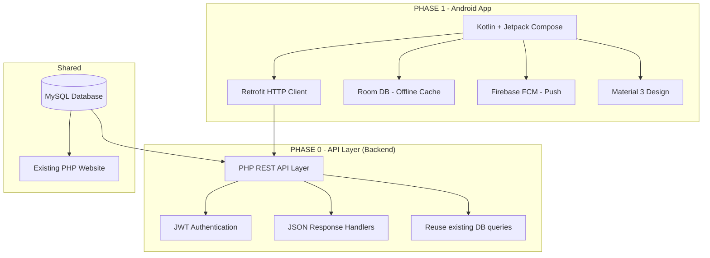
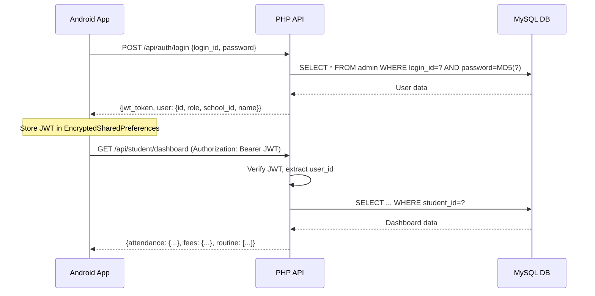

# 🚀 Convert Shikshashila ERP Website → Native Android App

## Problem & Background

The DPS School Management System (erp.shikshashila.com) is a large-scale PHP/MySQL school ERP with **200+ PHP files**, **15+ modules**, **6 user roles**, and **zero REST API layer**. The entire backend is server-rendered PHP pages with jQuery AJAX calls. We need to convert this into a **fully native Android app** within 15-20 days.

---

## ⚡ Technology Recommendation: **Kotlin + Jetpack Compose**

### Why Kotlin + Jetpack Compose? (Not Flutter, Not React Native)

| Criteria | Kotlin + Compose | Flutter | React Native |
|---|---|---|---|
| **Cost** | 100% Free & Open Source | Free | Free |
| **Google's Official** | ✅ Official Android language | Google but cross-platform | Facebook |
| **Future-Proof** | Google's #1 priority for Android | Good but separate ecosystem | Declining adoption |
| **Performance** | Native (best possible) | Near-native | JS Bridge overhead |
| **Play Store** | First-class citizen | Works fine | Works fine |
| **Learning Curve** | Medium (similar to Java) | New language (Dart) | JS but complex setup |
| **UI Toolkit** | Jetpack Compose (modern, declarative) | Material widgets | React components |
| **Offline Support** | Best (Room DB, native SQLite) | Possible but complex | Limited |
| **Push Notifications** | Firebase FCM (native) | Plugin needed | Plugin needed |
| **File Downloads/PDF** | Native APIs | Plugin needed | Plugin needed |
| **Camera/Gallery** | Native APIs | Plugin needed | Plugin needed |
| **App Size** | Smallest (~5-8 MB) | ~15-25 MB | ~15-20 MB |
| **Maintenance** | Easiest long-term for Android | OK | JS ecosystem churn |

> [!IMPORTANT]
> **Verdict: Kotlin + Jetpack Compose** is the best choice because:
> 1. **It's Google's official recommended language** for Android — they will never deprecate it
> 2. **100% free** — Android Studio, Kotlin, all libraries are open source
> 3. **Best performance** — no bridge, no runtime overhead, pure native
> 4. **Smallest APK size** — critical for Indian schools with low-storage phones
> 5. **Best offline support** — Room database for local caching
> 6. **You only need Android** — the question says Android app, not iOS + Android
> 7. **Job market** — Kotlin is the most in-demand Android skill in India

> [!NOTE]
> If in the future you also need **iOS**, you can extend this to **Kotlin Multiplatform (KMP)** — same language, shared business logic, native UI on both platforms. This is a smooth upgrade path that Flutter/RN cannot offer.

---

## 📊 Codebase Analysis — What We're Converting

### User Roles Identified (from [permission.php](file:///Users/sunnysharma/school_vel/include/permission.php))

| a_type | Role | Dashboard | Priority for App |
|---|---|---|---|
| 1 | Super Admin | [school_dashboard.php](file:///Users/sunnysharma/school_vel/include/school_dashboard.php) | 🔴 Phase 2 (complex admin) |
| 2 | School Admin | school_dashboard.php | 🔴 Phase 2 |
| 3 | Teacher | [teacher_dashboard.php](file:///Users/sunnysharma/school_vel/include/teacher_dashboard.php) | 🟢 Phase 1 |
| 4 | Student | [student_dashboard.php](file:///Users/sunnysharma/school_vel/include/student_dashboard.php) | 🟢 Phase 1 |
| 7 | Accounts | school_dashboard variant | 🟡 Phase 3 |
| 8 | Examination | school_dashboard variant | 🟡 Phase 3 |
| 9 | Library | school_dashboard variant | 🟡 Phase 3 |

### Modules Identified (from [ift/](file:///Users/sunnysharma/school_vel/ift) directory)

| Module | Files Count | Phase | Key Features |
|---|---|---|---|
| **Student** | 17 files | Phase 1 | Dashboard, attendance, results, homework, notes, fee payment, ID card, routine |
| **Teacher** | 50 files | Phase 1 | Dashboard, take attendance, assignments, results, student list, routine |
| **Attendance** | 1 file (events) | Phase 1 | Add events/calendar |
| **Account/Fees** | 19 files | Phase 2 | Fee collection, receipts, due reports, statements |
| **Admission** | 10 files | Phase 2 | Registration, student list, leads |
| **Examination** | 27 files | Phase 2 | Exam types, mark upload, admit cards, results |
| **Result Section** | 14 files | Phase 2 | Marksheets, class marks, print results |
| **Class/Subject** | 15 files | Phase 2 | Manage classes, sections, subjects, chapters |
| **HR** | 21 files | Phase 3 | Staff management, leave, salary, holidays, notices |
| **Communication** | 9 files | Phase 3 | SMS, Email, WhatsApp templates |
| **Transport** | 8 sub-modules | Phase 3 | Vehicles, routes, fuel, drivers, running cost |
| **Library** | 10 files | Phase 3 | Books, issue/return, categories |
| **School Settings** | 8 files | Phase 3 | Permissions, school config |
| **Package** | 1 file | Phase 3 | Package management |

### Authentication Flow (from [loginaction.php](file:///Users/sunnysharma/school_vel/action/loginaction.php))

```
Login ID/Email + MD5 Password
     ↓
Session-based auth (PHP sessions)
     ↓
OTP verification via Email (PHPMailer)
     ↓
Login history logging (IP, browser, etc.)
     ↓
Role-based dashboard redirect
```

### Current Architecture Problem

```
❌ NO REST API exists — all pages are server-rendered PHP
❌ NO JWT/Token auth — uses PHP sessions (won't work for mobile)
❌ AJAX calls return HTML fragments, not JSON
❌ Direct DB queries in page files (no service layer)
```

---

## 🏗️ Architecture Plan — Two-Pronged Approach

### What We Must Build



> [!WARNING]
> **Critical Decision: We MUST build a PHP REST API layer first.** The Android app cannot consume server-rendered HTML pages. This is ~3-4 days of work but it's unavoidable. The good news: we can reuse ALL existing SQL queries — we just wrap them in JSON responses instead of HTML.

---

## 📅 Implementation Plan — 15-Day Sprint

### PHASE 0: REST API Layer (Days 1-4)

> Build a lightweight PHP API layer in a new `api/` directory. Reuses existing DB connection and queries.

#### [NEW] `api/.htaccess`
- API-specific URL rewriting rules
- CORS headers for mobile app

#### [NEW] `api/config.php`  
- Includes existing `../config/config.php`
- Sets JSON content-type headers
- CORS configuration
- JWT secret key definition

#### [NEW] `api/middleware/auth.php`
- JWT token verification middleware
- Extracts user info from token
- Returns 401 for invalid/expired tokens

#### [NEW] `api/helpers/response.php`
- Standard JSON response helper: `json_success($data)`, `json_error($message, $code)`
- Pagination helper

#### [NEW] `api/auth/login.php`
- POST endpoint: accepts login_id + password
- Reuses query from loginaction.php line 328
- Returns JWT token + user data (role, school_id, name)
- No session needed — stateless JWT

#### [NEW] `api/auth/otp_verify.php`
- POST endpoint: verifies OTP
- Returns final JWT token

#### [NEW] `api/auth/logout.php`
- POST endpoint: invalidates token (optional blacklist)

---

#### [NEW] `api/student/dashboard.php`
- GET endpoint: returns attendance stats, fee summary, today's routine
- Reuses queries from [student_dashboard.php](file:///Users/sunnysharma/school_vel/include/student_dashboard.php)

#### [NEW] `api/student/attendance.php`
- GET endpoint: monthly/yearly attendance data
- Reuses queries from [view_attendance_new.php](file:///Users/sunnysharma/school_vel/ift/student/view_attendance_new.php)

#### [NEW] `api/student/results.php`
- GET endpoint: exam results by exam type
- Reuses queries from [all_result_student.php](file:///Users/sunnysharma/school_vel/ift/student/all_result_student.php)

#### [NEW] `api/student/homework.php`
- GET endpoint: homework/assignments list
- Reuses queries from [view_assignment_homework.php](file:///Users/sunnysharma/school_vel/ift/student/view_assignment_homework.php)

#### [NEW] `api/student/fees.php`
- GET endpoint: payment history, due amounts
- Reuses queries from [payment_paid.php](file:///Users/sunnysharma/school_vel/ift/student/payment_paid.php)

#### [NEW] `api/student/routine.php`
- GET endpoint: class timetable/routine
- Reuses queries from [view_routine.php](file:///Users/sunnysharma/school_vel/ift/student/view_routine.php)

#### [NEW] `api/student/notes.php`
- GET endpoint: study notes list
- Reuses queries from [notes.php](file:///Users/sunnysharma/school_vel/ift/student/notes.php)

#### [NEW] `api/student/id_card.php`
- GET endpoint: student ID card data + photo URL
- Reuses queries from [id_card.php](file:///Users/sunnysharma/school_vel/ift/student/id_card.php)

---

#### [NEW] `api/teacher/dashboard.php`
- GET endpoint: teacher stats, assigned classes, today's schedule
- Reuses queries from [teacher_dashboard.php](file:///Users/sunnysharma/school_vel/include/teacher_dashboard.php)

#### [NEW] `api/teacher/students.php`
- GET endpoint: list students by class/section
- Reuses queries from [view_my_student.php](file:///Users/sunnysharma/school_vel/ift/teacher/view_my_student.php)

#### [NEW] `api/teacher/attendance.php`
- GET + POST endpoints: view and take attendance
- Reuses queries from [takeattendance.php](file:///Users/sunnysharma/school_vel/ift/teacher/takeattendance.php) and [class_attendance.php](file:///Users/sunnysharma/school_vel/ift/teacher/class_attendance.php)

#### [NEW] `api/teacher/assignments.php`
- GET + POST endpoints: view and give homework
- Reuses queries from [assignment_homework.php](file:///Users/sunnysharma/school_vel/ift/teacher/assignment_homework.php)

#### [NEW] `api/teacher/routine.php`
- GET endpoint: teacher's timetable
- Reuses queries from [teacher_routines.php](file:///Users/sunnysharma/school_vel/ift/teacher/teacher_routines.php)

#### [NEW] `api/teacher/results.php`
- GET endpoint: student results
- Reuses queries from [all_result.php](file:///Users/sunnysharma/school_vel/ift/teacher/all_result.php)

#### [NEW] `api/common/filters.php`
- GET endpoint: classes, sections, subjects, sessions dropdown data
- Reuses queries from various [ajaxfilter.php](file:///Users/sunnysharma/school_vel/ift/teacher/ajaxfilter.php) files

---

### PHASE 1: Android App — Student & Teacher (Days 4-12)

> New Android project using Kotlin + Jetpack Compose

#### Project Structure
```
ShikshashilaApp/
├── app/
│   ├── src/main/java/com/shikshashila/app/
│   │   ├── di/                      # Dependency Injection (Hilt)
│   │   ├── data/
│   │   │   ├── api/                 # Retrofit API service interfaces
│   │   │   ├── local/               # Room database, DAOs
│   │   │   ├── model/               # Data classes (Student, Teacher, etc.)
│   │   │   └── repository/          # Repository pattern
│   │   ├── domain/
│   │   │   └── usecase/             # Business logic use cases
│   │   ├── ui/
│   │   │   ├── auth/                # Login, OTP screens
│   │   │   ├── student/             # Student screens
│   │   │   │   ├── dashboard/
│   │   │   │   ├── attendance/
│   │   │   │   ├── results/
│   │   │   │   ├── homework/
│   │   │   │   ├── fees/
│   │   │   │   ├── routine/
│   │   │   │   ├── notes/
│   │   │   │   └── idcard/
│   │   │   ├── teacher/             # Teacher screens
│   │   │   │   ├── dashboard/
│   │   │   │   ├── students/
│   │   │   │   ├── attendance/
│   │   │   │   ├── assignments/
│   │   │   │   ├── routine/
│   │   │   │   └── results/
│   │   │   ├── common/              # Shared UI components
│   │   │   └── theme/               # Material 3 theme
│   │   └── util/                    # Utility classes
│   ├── src/main/res/                # Resources, icons, strings
│   └── build.gradle.kts
├── build.gradle.kts
└── settings.gradle.kts
```

#### Android Tech Stack (All Free & Open Source)

| Library | Purpose | Why |
|---|---|---|
| **Jetpack Compose** | UI Framework | Modern, declarative, Google's future |
| **Material 3** | Design System | Beautiful, consistent, accessible |
| **Retrofit 2** | HTTP Client | Industry standard for API calls |
| **OkHttp** | Network Layer | Caching, interceptors, logging |
| **Hilt** | Dependency Injection | Google's recommended DI |
| **Room** | Local Database | Offline caching, SQLite wrapper |
| **Navigation Compose** | Screen Navigation | Type-safe navigation |
| **Coil** | Image Loading | Lightweight, Compose-native |
| **DataStore** | Preferences Storage | JWT token storage |
| **Firebase FCM** | Push Notifications | Free tier sufficient |
| **Accompanist** | UI Helpers | Pull-to-refresh, system bars |
| **Coroutines + Flow** | Async Operations | Non-blocking, reactive streams |

#### Screens to Build (Phase 1)

**Auth Module (2 screens):**
1. **Login Screen** — Login ID/Email + Password + School logo
2. **OTP Verification Screen** — 6-digit OTP input + resend

**Student Module (8 screens):**
1. **Student Dashboard** — Attendance donut chart, fee summary cards, quick links
2. **View Attendance** — Monthly calendar view with present/absent/holiday markers
3. **View Results** — Exam-wise results with grades, marks table
4. **View Homework** — Assignment list with due dates, file downloads
5. **Fee History** — Payment receipts list, total due amount
6. **Class Routine** — Weekly timetable grid
7. **Study Notes** — Notes list with PDF/file download
8. **ID Card** — Digital ID card with student photo, QR code

**Teacher Module (7 screens):**
1. **Teacher Dashboard** — Classes count, subjects, today's schedule
2. **My Students** — Class-wise student list with search
3. **Take Attendance** — Swipeable present/absent marking per student
4. **View Attendance** — Monthly attendance report with filters
5. **Assignments** — Give homework form + view submissions
6. **My Routine** — Teacher's weekly timetable
7. **Student Results** — Class-wise result entry/view

**Common Components:**
- Bottom Navigation Bar (Dashboard, Attendance, More)
- Top App Bar with school name + profile
- Pull-to-refresh on all list screens
- Offline indicator banner
- Empty state illustrations

---

### PHASE 2: Admin & Fee Modules (Days 12-15)

#### Additional API Endpoints
- `api/admin/dashboard.php` — School-wide stats
- `api/admin/students.php` — Full student CRUD
- `api/account/fees.php` — Fee collection, receipts
- `api/account/reports.php` — Fee reports, dues
- `api/examination/exams.php` — Exam management

#### Additional Android Screens
- Admin Dashboard (stats cards, charts)
- Fee Collection Screen
- Fee Receipt PDF generation
- Exam Mark Upload

---

### PHASE 3: Remaining Modules (Post-Launch, Days 16+)
- HR module (staff, leave, salary)
- Library module (books, issue/return)
- Transport module
- Communication module (SMS/Email/WhatsApp)
- Push notification integration
- Offline-first with sync queue

---

## 🔐 Security Architecture



- **JWT tokens** with 24-hour expiry + refresh token (7 days)
- **EncryptedSharedPreferences** for secure token storage on device
- **HTTPS only** — API rejects HTTP
- **Rate limiting** on login endpoint (5 attempts per 15 minutes)
- **Input validation** on both client and server side

---

## 📱 UI/UX Design Principles

- **Material 3 Dynamic Color** — adapts to user's wallpaper
- **Dark mode support** out of the box
- **Bottom Navigation** — Dashboard | Attendance | Fees | Profile
- **Shimmer loading** placeholders instead of spinners
- **Pull-to-refresh** on all data screens
- **School branding** — school logo + name in app bar (fetched from API)
- **Hindi/English** — string resources for multi-language support

---

## User Review Required

> [!IMPORTANT]
> **Decision 1: Android Only vs Cross-Platform**
> This plan is for **Android only** using Kotlin. If you also need iOS in the future, the upgrade path is Kotlin Multiplatform (KMP). Do you want Android only, or should we consider Flutter/React Native for both platforms from day one?

> [!IMPORTANT]  
> **Decision 2: Phase 1 Scope**
> The plan prioritizes **Student + Teacher** modules first (the most used roles). Admin/Accounts modules come in Phase 2. Is this priority correct, or do you need the Accounts module in Phase 1?

> [!IMPORTANT]
> **Decision 3: API Location**
> The REST API will be added as a new `api/` directory inside the existing PHP project and deployed on the same server (erp.shikshashila.com/api/). This means zero infrastructure cost. Is this acceptable?

> [!WARNING]
> **Decision 4: Existing `app.json` with Expo Project ID**
> I found an existing [app.json](file:///Users/sunnysharma/school_vel/app.json) with an Expo/React Native project ID (`e6fca726-8feb-4ce1-a6f3-a8c42892ab0a`). Was there a previous attempt to build a React Native app? Should we abandon that approach, or do you have any existing React Native code we should know about?

## Open Questions

> [!IMPORTANT]
> 1. **Play Store Account** — Do you already have a Google Play Developer account ($25 one-time fee)? We need this for publishing.
> 2. **Push Notifications** — Do you want Firebase push notifications (e.g., "New homework assigned", "Fee due reminder")? This requires a Firebase project (free tier).
> 3. **Offline Mode** — How important is offline support? (e.g., teacher takes attendance without internet, syncs later)
> 4. **Which school logos/branding assets** do you have? We need app icon, splash screen assets.
> 5. **Min Android version** — Should we support Android 7+ (Nougat, 95% coverage) or Android 8+ (Oreo, 90% coverage)?

---

## Verification Plan

### Automated Tests
```bash
# API endpoints testing
curl -X POST https://erp.shikshashila.com/api/auth/login -d '{"login_id":"test","password":"test"}'

# Android build
./gradlew assembleDebug
./gradlew test
./gradlew connectedAndroidTest
```

### Manual Verification
- Test login flow on 3+ Android devices (different screen sizes)
- Verify each dashboard loads correct data per role
- Test offline → online sync for attendance
- Test APK installation on real devices
- Verify PDF download for fee receipts
- Load test API with 100 concurrent requests

---

## 💰 Cost Summary

| Item | Cost |
|---|---|
| Kotlin + Android Studio | **FREE** |
| Jetpack Compose + all libraries | **FREE** |
| Firebase (push notifications) | **FREE** (up to 500K devices) |
| API hosting | **FREE** (same server) |
| Google Play Developer Account | **₹1,900 one-time** ($25) |
| **Total** | **₹1,900 one-time** |

---

## 📋 Day-by-Day Timeline

| Day | Task | Deliverable |
|---|---|---|
| **Day 1** | Set up `api/` directory, JWT auth, login endpoint | Working login API |
| **Day 2** | Student API endpoints (dashboard, attendance, results) | Student APIs |
| **Day 3** | Teacher API endpoints (dashboard, students, attendance) | Teacher APIs |
| **Day 4** | Common APIs (filters, routine) + API testing | All Phase 1 APIs done |
| **Day 5** | Android project setup, theme, navigation, DI | App skeleton |
| **Day 6** | Login + OTP screens, JWT storage, auth flow | Working login on app |
| **Day 7** | Student Dashboard + Attendance screen | Student core screens |
| **Day 8** | Student Results + Homework + Fees screens | Student remaining screens |
| **Day 9** | Student Routine + Notes + ID Card screens | Student module complete |
| **Day 10** | Teacher Dashboard + My Students screen | Teacher core screens |
| **Day 11** | Take Attendance (swipe UI) + View Attendance | Teacher attendance |
| **Day 12** | Teacher Assignments + Routine + Results | Teacher module complete |
| **Day 13** | Polish UI, fix bugs, add loading/error states | Quality pass |
| **Day 14** | Testing on multiple devices, performance optimization | QA pass |
| **Day 15** | Build signed APK, Play Store assets, publish | **🚀 LAUNCH** |
